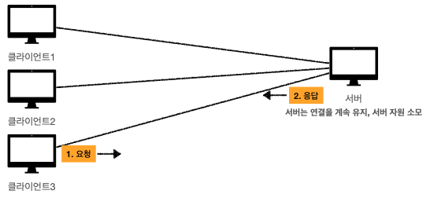
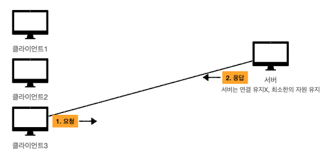
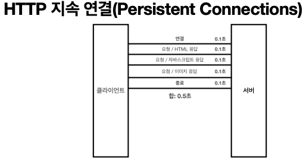
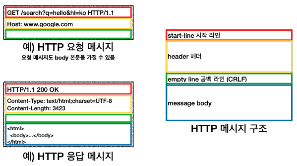
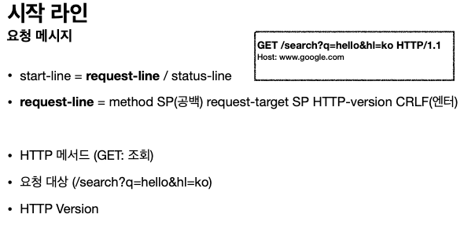
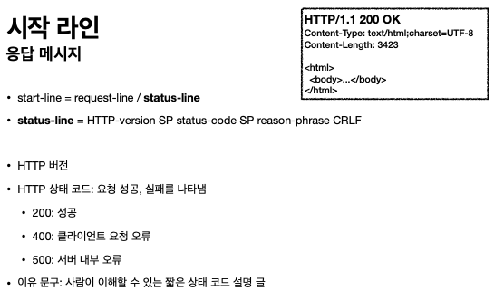
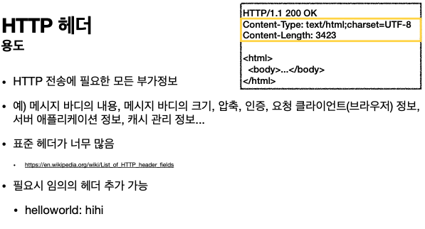

# HTTP 기본

## 목차
### 1. 모든 것이 HTTP

### 2. 클라이언트 서버 구조

### 3. Stateful, Stateless

### 4. 비 연결성(connectionless)

---

## 1. 모든 것이 HTTP

- ### Http로 전송 하는 것
  - HTML, TEXT
  - Image, 음성, 영상, 파일
  - JSON, XML(API)
  - 거의 모든 형태의 데이터 전송 가능
  - 서버간에 데이터를 주고 받을 때도 대부분 HTTP 사용

- ### Http 역사
  - HTTP/0.9 1991년: GET 메서드만 지원, HTTP 헤더X  
  - HTTP/1.0 1996년: 메서드, 헤더 추가  
  - _**HTTP/1.1 1997년: 가장 많이 사용, 우리에게 가장 중요한 버전**_  
  - RFC2068 (1997) -> RFC2616 (1999) -> RFC7230~7235 (2014) HTTP/2 2015년: 성능 개선  
  - HTTP/3 진행중: TCP 대신에 UDP 사용, 성능 개선

- ### 기반 프로토콜
  - `TCP` : HTTP/1.1, HTTP/2
  - `UDP` : HTTP/3 -> TCP는 3-way handshake와 같은 속도혀인 측면에서 느림
  - 현재 HTTP/1.1 주로 사용

- ### HTTP 특징
  - 클라이언트 서버 구조
  - 무상태 프로토콜, 비연결성
  - HTTP 메시지
  - 단순함, 확장 가능

## 2. 클라이언트 서버 구조
  - Request Response 구조
  - 클라이언트는 서버에 요청을 보내고, 응답을 대기
  - 서버가 요청에 대한 결과를 만들어서 응답
  - 클라이언트는 UI, 사용성에 집중
  - 서버는 데이터, 복잡한 비즈니스 로직에 집중
  - 결국 클라이언트, 서버 각각 독립적으로 진화 가능

## 3. 무상태 프로토콜
  - 서버가 클라이언트의 상태를 보존 X
  - 장점 : 서버 확장성 높음 (스케일 아웃 - 수평 확장)
  - 단점 : 클라이언트가 추가 데이터 전송
  
  - ### Stateful 상태
  > 고객 : `노트북` 얼마인가요?  
  > 점원 : 100만원 입니다. (`노트북` 상태 유지)  
  > 고객 : `2개` 구매하겠습니다  
  > 점원 : 200만원 입니다. `신용카드 or 현금`? (`노트북`, `2개` 상태 유지)  
  > 고객 : `신용카드` 사용  
  > 점원 : 200만원 결제 완료 (`노트북`, `2개`, `신용카드` 상태 유지)  

  - ### Stateless 상태
  > 고객 : `노트북` 얼마인가요?  
  > 점원 : 100만원 입니다.
  > 고객 : `노트북` `2개` 구매하겠습니다  
  > 점원 : `노트북` `2개`는 200만원 입니다. `신용카드 or 현금`?  
  > 고객 : `노트북` `2개`를`신용카드` 사용  
  > 점원 : 200만원 결제 완료

  - ### Stateful, Stateless 차이
    - 상태 유지 : 중간에 다른 점원으로 바뀌면 안된다.
    - 무상태 : 중간에 점원으로 바뀌어도 가능
    - 무상태는 응답 서버를 쉽게 바꿀 수 있다 -> **무한한 서버 증설 가능**

  - ### 무상태(Stateless) 한계
    - 로그인 기능은 상태 유지가 필요
    - 일반적으로 브라우저 쿠키와 서버 세션등을 사용해서 상태유지
    - 상태 유지는 최소한만 사용
    - 데이터를 너무 많이 보냄

  
## 4. 비 연결성
- 연결을 유지하는 모델  

  - 연결 유지 하면서 서버 자원 소모 
- 연결을 유지하지 않는 모델   

  - 서버는 연결 유지X 최소한의 자원 유지
  
- ### 한계와 극복
  - TCP/IP 연결을 새로 맺어야 함 - 3 way handshake 시간 추가
  - 웹 브라우저로 사이트를 요청하면 HTML 뿐만 아니라 자바스크립트, css, 추가 이미지 등 수많은 자원이 함께 다운로드
  - 지금은 HTTP 지속 연결(Persistent Connections)로 문제 해결  
    

## 5. HTTP 메시지

- ### 메시지 구조  

- 공백라인(CRLF) 필수!!

- ### 시작 라인(요청 메시지)   

- ### 시작 라인(응답 메시지)    

- ### HTTP 헤더  

- ### HTTP 메시지 바디  

