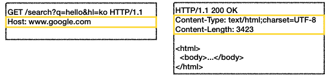
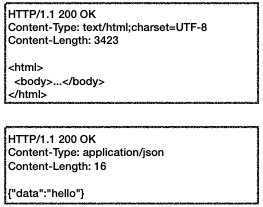
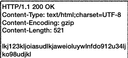
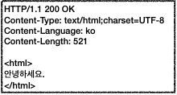
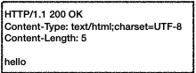
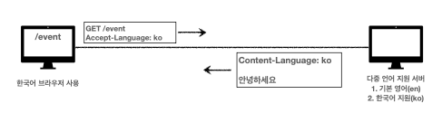
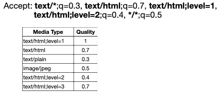

# HTTP Header

## 목차

- ### [HTTP 헤더](#HTTP-헤더)

- ### [표현](#표현)

- ### [협상](#협상)


## HTTP 헤더  



- header-field = field-name ":" OWS field-value OWS (OWS : 띄어쓰기 허용)
- field-name : 대소문자 구문 없음

### 용도
- HTTP 전송에 필요한 모든 부가정보
- 메시지 바디의 내용, 메시지 바디의 크기, 압축, 인증, 요청 클라이언트, 서버정도, 캐시관리정보 .....
- 표준 헤더는 많음
- 필요시 임의의 헤더 추가 가능

## RFC2616 - 과거
- General : 메시지 전체에 적용되는 정보 - Connection: close
- Request : 요청 정보 - User-Agent: Mozilla/5.0
- Response : 응답 정보 - Server: Apache
- Entity : 엔티티 바디 정보 - Content-Type: text/html

## RFC723X 변화
- 엔티티 -> **표현**
- Representation = representation Metadata + Representation Data
- `표현` = 표현 메타데이터 + 포현 데이터

### HTTP BODY
- 메시지 본문을 통해 표현 데이터 전달
- 메시지 본문 = 페이로드
- 표현은 요청이나 응답에서 전달할 실제 데이터
- 표현 헤더는 표현 데이터를 해석할 수 있는 정보 제공
  - 데이터 유형(html, json), 데이터 길이, 압축 정보 등등
- 표현 헤더는 표현 메타데이터와 페이로드 메시지를 구분해야 하지만 생략


## 표현

- ### Content-Type : 표현 데이터의 형식   
    
    - 미디어 타입, 문자 인코당
    - ex) text/html; charset=utf-8, application/json, image/png
  
- ### Content-Encoding : 표현 데이터의 압축 방식  
    
    - 표현 데이터를 압축하기 위해 사용
    - 데이터를 전달하는 곳에서 압축 후 인코딩 헤더 추가
    - 데이터를 읽는 쪽에서 인코딩 헤더의 정보로 압축 해제
    - ex) gzip, deflate, identity(압축안함)

- ### Content-Language : 표현 데이터의 자연 언어  
    
    - 표현 데이터의 자연 언어를 표현 
    - ex) ko, en, en-US

- ### Content-Length : 표현 데이터의 길이
    
    - 바이트 단위
    - Transfer-Encoding(전송 인코딩)을 사용하면 Content-Length를 사용하면 안됨
- ### 표현 헤더는 전송, 응답 **둘다** 사용


## 협상
#### 클라이언트가 선호하는 표현 요청 (콘텐츠 네고시에이션)
- Accept : 클라이언트가 선호하는 미디어 타입 전달
- Accept-Charset : 클라이언트가 선호하는 문자 인코딩
- Accept-Encoding : 클라이언트가 선호하는 압축 인코딩
- Accept-Language : 클라이언트가 선호하는 자연 언어
- 협상 헤더는 요청시에만 사용

### Accept-Language 적용 전
- 한국어 브라우저에서 다중언어 지원서버로 요청을 보내면 기본 설정인 영어로 응답이 온다

### Accept-Language 적용후



- Accept-Language:ko 적용시 한국어 지원 응답을 받음

### 협상 우선순위1 (Quality Values(q))
```http request
GET /event
Accept-Language: ko-KR,ko;q=0.9,en-US;q=0.8,en;q=0.7
```
- Quality Values(q) 값 사용
- 0 ~ 1, `클수록 높은 우선 순위`
- 생략하면 1
- Accept-Language: ko-KR,ko;q=0.9,en-US;q=0.8,en;q=0.7
  - 1 : ko-KR;q=1(q생략)
  - 2 : ko;q=0.9
  - 3 : en-US;q=0.8
  - 4 : en:q=0.7

### 협상 우선순위2
```http request
GET /event
Accept: text/*, text/plain, text/plain;format=flowed, */*
```
- 구체적인 것이 우선한다
- Accept: text/*, text/plain, text/plain;format=flowed, */*
  1. text/plain;format=flowed
  2. text/plain
  3. text/*
  4. */*

### 협상 우선순위3
- 구체적인 것을 기준으로 미디어 타입을 맞춘다



