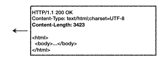
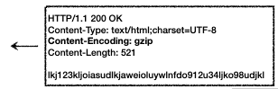
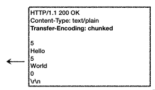
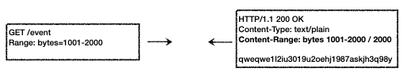
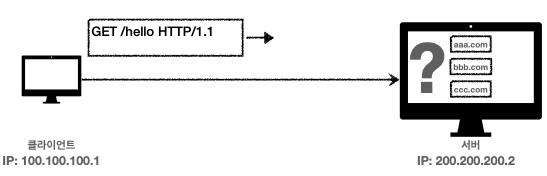
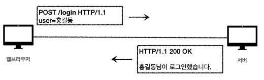
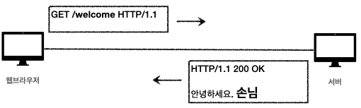
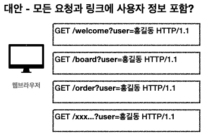
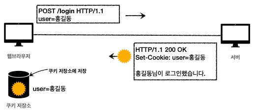
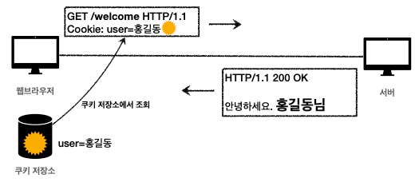

# HTTP Header

## 목차

- ### [HTTP 헤더](#HTTP-헤더)

- ### [표현](#표현)

- ### [협상](#협상)

- ### [전송 방식](#전송-방식)

- ### [일반 정보](#일반-정보)

- ### [특별한 정보](#특별한-정보)

- ### [인증](#인증)

- ### [쿠키](#쿠키)


## HTTP 헤더  


- header-field = field-name ":" OWS field-value OWS (OWS : 띄어쓰기 허용)
- field-name : 대소문자 구문 없음

### 용도
- HTTP 전송에 필요한 모든 부가정보
- 메시지 바디의 내용, 메시지 바디의 크기, 압축, 인증, 요청 클라이언트, 서버정도, 캐시관리정보 .....
- 표준 헤더는 많음
- 필요시 임의의 헤더 추가 가능

## RFC2616 - 과거
- General : 메시지 전체에 적용되는 정보 - Connection: close
- Request : 요청 정보 - User-Agent: Mozilla/5.0
- Response : 응답 정보 - Server: Apache
- Entity : 엔티티 바디 정보 - Content-Type: text/html

## RFC723X 변화
- 엔티티 -> **표현**
- Representation = representation Metadata + Representation Data
- `표현` = 표현 메타데이터 + 포현 데이터

### HTTP BODY
- 메시지 본문을 통해 표현 데이터 전달
- 메시지 본문 = 페이로드
- 표현은 요청이나 응답에서 전달할 실제 데이터
- 표현 헤더는 표현 데이터를 해석할 수 있는 정보 제공
  - 데이터 유형(html, json), 데이터 길이, 압축 정보 등등
- 표현 헤더는 표현 메타데이터와 페이로드 메시지를 구분해야 하지만 생략


## 표현

- ### Content-Type : 표현 데이터의 형식   
    
    - 미디어 타입, 문자 인코당
    - ex) text/html; charset=utf-8, application/json, image/png
  
- ### Content-Encoding : 표현 데이터의 압축 방식  
    
    - 표현 데이터를 압축하기 위해 사용
    - 데이터를 전달하는 곳에서 압축 후 인코딩 헤더 추가
    - 데이터를 읽는 쪽에서 인코딩 헤더의 정보로 압축 해제
    - ex) gzip, deflate, identity(압축안함)

- ### Content-Language : 표현 데이터의 자연 언어  
    
    - 표현 데이터의 자연 언어를 표현 
    - ex) ko, en, en-US

- ### Content-Length : 표현 데이터의 길이
    
    - 바이트 단위
    - Transfer-Encoding(전송 인코딩)을 사용하면 Content-Length를 사용하면 안됨
- ### 표현 헤더는 전송, 응답 **둘다** 사용


## 협상
#### 클라이언트가 선호하는 표현 요청 (콘텐츠 네고시에이션)
- Accept : 클라이언트가 선호하는 미디어 타입 전달
- Accept-Charset : 클라이언트가 선호하는 문자 인코딩
- Accept-Encoding : 클라이언트가 선호하는 압축 인코딩
- Accept-Language : 클라이언트가 선호하는 자연 언어
- 협상 헤더는 요청시에만 사용

### Accept-Language 적용 전
- 한국어 브라우저에서 다중언어 지원서버로 요청을 보내면 기본 설정인 영어로 응답이 온다

### Accept-Language 적용후


- Accept-Language:ko 적용시 한국어 지원 응답을 받음

### 협상 우선순위1 (Quality Values(q))
```http request
GET /event
Accept-Language: ko-KR,ko;q=0.9,en-US;q=0.8,en;q=0.7
```
- Quality Values(q) 값 사용
- 0 ~ 1, `클수록 높은 우선 순위`
- 생략하면 1
- Accept-Language: ko-KR,ko;q=0.9,en-US;q=0.8,en;q=0.7
  - 1 : ko-KR;q=1(q생략)
  - 2 : ko;q=0.9
  - 3 : en-US;q=0.8
  - 4 : en:q=0.7

### 협상 우선순위2
```http request
GET /event
Accept: text/*, text/plain, text/plain;format=flowed, */*
```
- 구체적인 것이 우선한다
- Accept: text/*, text/plain, text/plain;format=flowed, */*
  1. text/plain;format=flowed
  2. text/plain
  3. text/*
  4. */*

### 협상 우선순위3
- 구체적인 것을 기준으로 미디어 타입을 맞춘다


## 전송 방식

### 1. 단순 전송


- content에 대한 길이를 알 수 있을 때

### 2. 압축 전송


- 용량을 줄이기 위해 `Content-Encoding`으로 명시 

### 3. 분할 전송


- 분할한 만큼 바로 전송 마지막에는 `\r\n`으로 표시

### 4. 범위 전송


- 이미지 같은것을 보낼 때 중간에 끊겼을 때 중간부분 부터 다시 보낼 수 있다
- `[범위]/총 길이` 로 표현


## 일반 정보

### From : 유저 에이전트의 이메일 정보
- 일반적으로 잘 사용 X
- 검색 엔진 같은 곳에서, 주로 사용
- 요청에서 사용

### Referer : 이전 웹 페이지 주소
- 현재 요청된 페이지의 이전 웹 페이지 주소
- A -> B로 이동하는 경우 B를 요청할 때 Referer: A를 포함 해서 요청
- Referer를 사용해서 유입 경로 분석 가능
- 요청에서 사용

### User-Agent : 유저 에이전트 애플리케이션 정보
- 클라이언트의 애플리케이션 정보 (웹 브라우저 정보, 등등)
- 통계 정보
- 어떤 종류의 브라우저에서 장애가 발생하는지 파악 가능
- 요청에서 사용

### Server : 요청을 처리하는 ORIGIN 서버의 소프트웨어 정보
- Server: Apache/2.2.22(Debian)
- server: nginx
- 응답에서 사용

### Date : 메시지가 발생한 날짜와 시간
- Date: Tue, 15 Nov 1994 08:12:31 GMT
- 응답에서 사용


## 특별한 정보

### Host : 요청한 호스트 정보(도메인)

- 요청에서 사용
- `필수`
- 하나의 서버가 여러 도메인을 처리해야 할 때
- 하나의 IP 주소에 여러 도메인이 적용되어 있을 때

### Location : 페이지 리다이렉션
- 웹 프라우저는 3xx 응답의 결과에 Location 헤더가 있으면, Location 위치로 자동 이동
- 응답코드 3xx에서 설명
- 201 (Created) : Location 값은 요청에 의해 생성도니 리소스 URI
- 3xx (Redirection) : Location 값은 요청을 자동으로 리다이렉션 하기 위해 대상 리소스를 가리킴

### Allow : 허용 가능한 HTTP 메서드
- 405(Method Not Allowed) 에서 응답에 포함해야함
- Allow : GET, HEAD, PUT

### Retry-After : 유저 에이전트가 다음 요청을 하기까지 기다려야 하는 시간
- 503(Service Unavailable) : 서비스가 언제까지 불능인지 알려줄 수 있음
- Retry-After: Fri, 31 Dec 1999 23:59:59 GMT (날짜 표기)
- Retry-After: 120 (초단위 표기)


## 인증

### Authorization
- 클라이언트 인증 정보를 서버에 전달
- Authorization: Basic xxxxxxxxxxxxxxxx

### WWW-Authenticate
- 리소스 접근시 필요한 인증 방법 정의
- 401 Unauthorized 응답과 함께 사용
- WWW-Authenticate: Newauth realm="apps", type=1, 

  title="Login to \"apps\"", Basic realm="simple"


## 쿠키
- Set-Cookie : 서버에서 클라이언트로 쿠키 전달(응답)
- Cookie : 클라이언트가 서버에서 받은 쿠키를 저장하고, HTTP 요청시 서버로 전달

### 쿠키 미사용
- 로그인  
  

- 로그인 이후 접근  
  
  - 로그인 상태가 유지가 안됨 -> Stateless

### Stateless
- HTTP는 무상태 프로토콜
- 클라이언트와 서버가 요청과 응듭을 주고 받으면 연결이 끊어진다
- 클라이언트가 다시 요청하면 서버는 이전 요청을 기억하지 못한다
- 클라이언트와 서버는 서로 상태를 유지하지 않는다

### 쿠키 미사용 - 문제해결
- 모든 요청에 사용자 정보 포함   
  
  ### 문제점
  - 모든 요청에 사용자 정보가 포함되도록 개발해야함
  - 브라우저를 완전히 종료하고 다시 열면?

### 쿠키 사용
- 로그인

  

- 로그인 이후 접근

  
  - 모든 요청에 쿠키 정보 자동 포함

### 쿠키란
- ex) `set-cookie: sessionId=abcde1234; expires=Sat, 26-Dec-2020 00:00:00 GMT; path=/; domain=.google.com; Secure`
- 사용처
  - 사용자 로그인 세션 관리
  - 광고 정보 트래킹
- 쿠키 정보는 항상 서버에 전송
  - 네트워크 트래픽 추가 유발
  - `최소한의 정보만 사용`(세션 id, 인증 토큰)
  - 서버에 전송하지 않고, 웹브라우저 내부에 데이터를 저장하고 싶으면 `웹 스토리지` 참고
- `주의`
  - 보안에 민감한 데이터는 저장하면 안됨 (주민번호, 신용카드 번호 등등)

### 쿠키 생명주기
- `Set-Cookie : expires=Sat, 26-Dec-2020 04:39:21 GMT`
  - 만료일이 되면 쿠키 삭제
- `Set-Cookie: max-age=3600` (3600초)
  - 0이나 음수를 지정하면 쿠키 삭제
- 세션 쿠키 : 만료 날짜를 생략하면 브라우저 종료시 까지만 유지
- 영속 쿠키 : 만료 날짜를 입력하면 해당 날짜까지 유지

### 쿠키 - 도메인
- ex) `domain=example.org`
- 명시 : 명시한 문서 기준 도메인 + 서브 도메인 포함
  - `domain=example.org`지정 -> `dev.example.org`도 쿠키 접근
- 생략 : 현재 문서 기준 도메인만 적용
  - 명시와 반대로 domain=example.org`지정 -> `dev.example.org`는 쿠키 미접근

### 쿠키 - 경로
- 이 경로를 포함한 하위 경로 페이지만 쿠키 접근
- 일반적으로 path=/ 루트로 지정
- ex) `path=/home` 지정
  - `/home` -> 가능
  - `/home/level1` -> 가능
  - `/hello` -> 불가능

### 쿠키 - 보안
- Secure
  - 쿠키는 http, https를 구분하지 않고 전송
  - Secure를 적용하면 https인 경우에만 전송
- HttpOnly
  - XSS 공격 방지
  - 자바스크립트에서 접근 불가
  - HTTP 전송에만 사용
- SameSite
  - XSRF 공격 방지
  - 요청 도메인과 쿠키에 설정된 도메인이 같은 경우만 쿠키 전송
