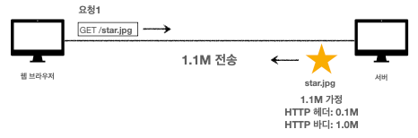
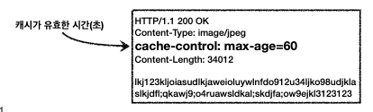
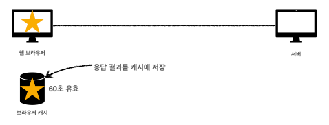
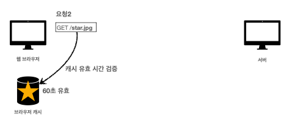
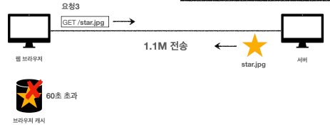
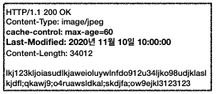
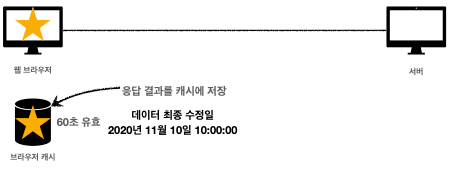
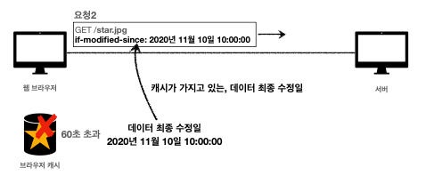
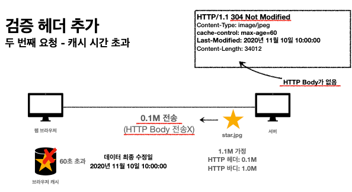

# Http Header2

## 목차

- ### [캐시 기본 동작](#캐시-기본-동작)
- ### [검증 헤더와 조건부 요청1](#검증-헤더와-조건부-요청1)
- ### 검증 헤더와 조건부 요청2
- ### 캐시와 조건부 요청 헤더
- ### 프록시 캐시
- ### 캐시 무효화

# 캐시 기본 동작

## 캐시가 없을 때
- 데이터가 변경되지 않아도 계속 네트워크를 통해서 데이터를 다운로드 받아야 한다
- 인터넷 네트워크는 매우 느리고 비싸다
- 브라우저 로딩 속도가 느리다
- 사용자는 느린 경험을 하게 된다

- ### 첫 번째 요청

    
- ### 두 번째 요청 시 똑같이 1.1M를 전송

## 캐시 적용
- 캐시 덕분에 캐시 가능 시간동안 네트워크를 사용하지 않아도 된다 
- 비싼 네트워크 사용량을 줄일 수 있다
- 브라우저 로딩 속도가 매우 빠르다
- 빠른 사용자 경험

- 헤더에 `cache-control`를 적용하여 캐시가 유효한 시간을 설정 

- ### 첫 번째 요청시

- 캐시 적용 전과 같이 온 응답 결과를 캐시에 저장한다

- ### 두 번째 요청

- 캐시안을 검사 해서 캐시 수명이 유효하면 캐시에서 가져옴

## 캐시 시간 초과

- 캐시 유효 시간이 초과하면, 서버를 통해 데이터를 다시 조회, 캐시 갱신
- 이때 다시 네트워크 다운로드가 발생

# 검증 헤더와 조건부 요청1

## 캐시 시간 초과
- 캐시 유효 시간이 초과해서 서버에 다시 요청했을 때 생길 수 있는 두 가지 상황
  1. 서버에서 기존 데이터를 변경함 -> 다시 요청하는게 적절
  2. 서버에서 기존 데이터를 변경하지 않음 -> 같은 데이터를 큰비용을 들여서 다시 다운로드를 받아야 할까??
### 캐시 만료후에도 서버에서 데이터를 변경하지 않음
- 생각해보면 데이터를 전송하는 대신에 저장해 두었던 캐시를 재사용 가능
- 단 클라이언트의 데이터와 서버의 데이터가 같다는 사실을 확인 할 방법이 필요

## 검증헤더 추가

- `Last-Modified: 2020년 11월 10일 10:00:00` -> 마지막에 수정된 날짜

- 첫번째 요청시 똑같이 캐시에 저장시 데이터 최종 수정일도 같이 저장

- 캐시 만료일이 지나고 두 번째 요청시 캐시가 가지고있는 최종 수정일도 같이 전송

- 서버에서 데이터 수정이 없을 시 `304 Not Modified`와 `HTTP Body`없이 전송한
- 캐시에 있는 데이터를 재사용하고 유효시간을 재설정함

### 검증 헤더와 조건부1 요청 정리
- 캐시 유효 시간이 초과해도, 서버의 데이터가 갱신되지 않으면
- `304 Not Modified` + 헤더 메타 정보만 응답(바디X)
- 클라이언트는 서버가 보낸 응답 헤더 정보로 캐시의 메타 정보를 갱신 클라이언트는 캐시에 저장되어 있는 데이터 재활용
- 결과적으로 네트워크 다운로드가 발생하지만 용량이 적은 헤더 정보만 다운로드 매우 실용적인 해결책

# 검증 헤더와 조건부2 요청

## 검증 헤더
- 캐시 데이터와 서버 데이터가 같은지 검증하는 데이터
- Last-Modified, ETag

## 조건부 요청 헤더
- 검증 헤더로 조건에 따른 분기
- `If-Modified-Since: Last-Modified` 사용
- `If-None-Match: ETag` 사용
- 조건이 만족하면 200 OK
- 조건이 만족하지 않으면 304 `Not Modified`

## 예시
- `If-Modified-Since`이후에 데이터가 수정되었으면?
### 데이터 미변경 예시
- 캐시: 2020년 11월 10일 10:00:00 vs 서버: 2020년 11월 10일 10:00:00
- `304 Not Modified`, 헤더 데이터만 전송(BODY 미포함)
  - 캐시로 리다이랙션
- 전송 용량 0.1M (헤더 0.1M, 바디 1.0M)

### 데이터 변경 예시
- 캐시: 2020년 11월 10일 10:00:00 vs 서버: 2020년 11월 10일 11:00:00
- `200 OK`, 모든 데이터 전송(BODY 포함)
- 전송 용량 1.1M(헤더 0.1M, 바디 1.0M)

### `Last-Modified`, `If-Modified-Since` 단점
- 1초 미만단위로 캐시 조정ㅇ 불가능
- 날짜 기반의 로직 사용
- 데이터를 수정해서 날짜가 다르지만, 같은 데이터를 수정해서 데이터 결과가 똑같은 경우
- 서버에서 별도의 캐시 로직을 관리하고 싶은 경우
  - ex) 스페이스나 주식처럼 크게 영향이 없는 변경에서 캐시를 유지하고 싶은 경우

# 캐시와 조건부 요청 헤더

## 캐시 제어 헤더

### 1. Cache-Control: 캐시 제어
- Cache-Control : max-age
  - 캐시 유효 시간, 초단위
- Cache-Control: no-cache
  - 데이터는 캐시해도 되지만, 항상 원(origin) 서버에 검증하고 사용
  - `If-Modified-Since`, `If-None-Match`등을 이용해서 검증
- Cache-Control: no-store
  - 데이터에 민감한 정보가 있으므로 저장하면 안됨
  - 메모리에서 사용하고 최대한 빨리 삭제

### 2. Pragma: 캐시 제어(하위 호환)
- Pragma: no-cache
- HTTP 1.0 하위 호환

### 3. Expires: 캐시 만료일 지정(하위 호환)
- `expires: Mon, 01 Jan 1990 00:00:00 GMT`
- 캐시 만료일을 정확한 날짜로 지정
- HTTP 1.0 부터 사용
- 지금은 더 유연한 Cache-Control: max-age 권장
- Cache-Control: max-age와 함께 사용하면 Expires는 무시