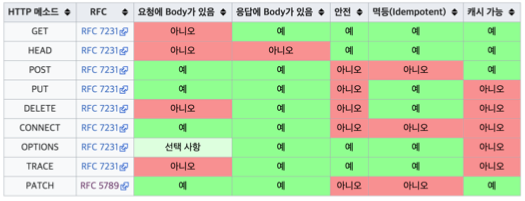

# HTTP Method

## 목차

- ### [1. HTTP API](#1.-HTTP-API)

- ### [2. GET, POST](#2.-GET,-POST)

- ### [3. PUT, PATCH, DELETE](#3.-PUT,-PATCH,-DELETE)

- ### [4. HTTP 메서드 속성](#4.-HTTP-메서드-속성)

---

# 1. HTTP API

### 요구사항 -> URI
- 회원 목록 조회 -> /read-member-list
- 회원 조회 -> /read-member-by-id
- 회원 등록 -> /create-member
- 회원 수정 -> /update-member
- 회원 삭제 -> /delete-member

### URI 설계
- URI 설계시 가장 중요한 것 -> `리소스 식별`

### 리소스의 의미
 - 회원을 등록하고 수정하고 조회하는게 리소스 X
 - `회원이라는 개념` 자체가 리소스
 - 회원이라는 리소스만 식별 -> 회원 리소스를 URI에 매핑

#### URI 새로 설계 
 - 회원 목록 조회 -> /member
 - 회원 조회 -> /member{?}
 - 회원 등록 -> /member{?}
 - 회원 수정 -> /member{?}
 - 회원 삭제 -> /member{?}
 - uri가 구분이 안됨 -> 뒤에 메서드로 해결

### 리소스와 행위를 분리!
- URI는 **리소스만** 식별

---

# 2. GET, POST

## HTTP 메서드 종류
- GET : 리소스 조회
- POST : 요청 데이터 처리, 주로 등록에 사용
- PUT : 리소스를 대체, 해당 리소스가 없으면 생성
- PATCH : 리소스 부분 변경
- DELETE : 리소스 삭제

## HTTP 메서드 종류
- HEAD : GET과 동일하지만 메시지 부분을 제외하고, 상태 줄과 헤더만 반환
- OPTIONS : 대상 리소스에 대한 통신 가능 옵션(메서드)을 설명(주로 CORS에서 사용)
- CONNECT : 대상 자원으로 식별되는 서버에 대한 터널을 설정
- TRACE : 대상 리소스에 대한 경로를 따라 메시지 루프백 테스트를 수행

## GET  

- 리소스 조회
- 서버에 전달하고 싶은 데이터는 query를 통해서 전달
- 메시지 바디를 사용해서 데이터를 전달할 수 있지만, 지원하지 않는 곳이 많아서 권장 X  
    
    

## POST  

- 요청 데이터 처리
  - 단순히 데이터를 생성하거나, 변경하는 것을 넘어서 프로세스를 처리해야 되는 경우
  - ex) 결제완료 -> 배달 시작 -> 배달 완료 (프로세스의 단계가 변경)
- **메시지 바디**를 통해 **서버로 요청** 데이터 전달
- 서버는 요청 데이터를 처리
  - 메시지 바디를 통해 들어온 데이터를 처리하는 모든 기능을 수행
- 주로 전달된 데이터로 신규 리소스 등록, 프로세스 처리에 사용  

  
- 신규 리소스 식별자 생성 (/members/100)  

  
    - 201일때 보통 Location(자원이 생성된 경로)을 같이 보냄 

### POST 요청 데이터 처리 할까?
- 리소스 URI에 POST요청이 오면 요청 데이터를 어떻게 처리할지 리소스마다 따로 정해야 한다 -> 정해진 것이 없음

___

# 3. PUT, PATCH, DELETE  

## PUT
- 리소스를 **완전히** 대체
  - 리소스가 있으면 대체 -> 덮어버림
  - 리소스가 없으면 생성
- **클라이언트가 리소스를 식별**
  - 클라이언트가 리소스 위치를 알고 URI 지정(/member이 아니라 /member/100으로 알고있음)
  - POST와 차이점  

  
- 완전히 대체   

## PATCH  

## delete
- 리소스를 제거
- 클라이언트가 리소스를 식별

---

## 4. HTTP 메서드 속성

### 안전
- 호출해도 리소스를 변경하지 않는다
- Q : 그래도 계속 호출해서, 로그 같은게 쌓여서 장애가 발생?
- A : 안전은 해당 리소스만 고려

### 멱등
- 한 번 호출하든 두 번 호출하든 100번 호출하든 결과가 같음
- 멱등 메서드
  - GET : 같은 결과를 조회
  - PUT : 결과를 대체 
  - DELETE : 결과를 삭제
  - `POST` : 멱등 X 두 번 호출하면 같은 결제가 중복해서 발생
- 활용법
  - 자동 복구 메커니즘
  - 서버가 TIMEOUT등으로 정상 응답을 못 줄때, 클라이언트가 같은 요청을 다시해도 되는가? -> 같은 요청 여러번 해도 괜찮음
- 멱등은 외부요인으로 중간에 리소스가 변경되는 것 까지 고려 X

### 캐시가능
- 응답 결과 리소스를 캐시해서 사용해도 되는가?
- GET, HEAD, POST, PATCH 캐시가능
- 실제로는 GET, HEAD 정도만 사용
