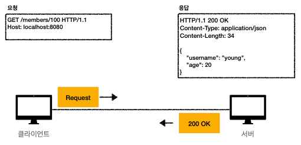
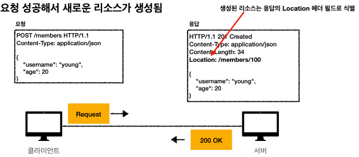
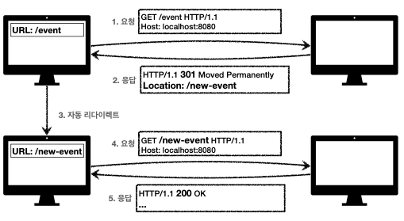

# HTTP 상태코드

## 목차

- ### [1. 상태코드](#1.-상태코드)
- ### [2. 2xx](#2.-2xx)
- ### [3. 3xx](#3.-3xx)
- ### [4. 4xx, 5xx](#4.-4xx,-5xx)

---

# 1. 상태코드
- ### 클라이언트가 보낸 요청의 처리 상태를 응답에서 알려주는 기능
- 1xx (Informational) : 요청이 수신되어 처리중
- 2xx (Successful) : 요청 정상 처리
- 3xx (Redirection) : 요청을 완료하려면 추가 행동이 필요
- 4xx (Client Error) : 클라이언트 오류, 잘못된 문법등으로 서버가 요청을 수행할 수 없음
- 5xx (Server Error) : 서버 오류, 서버가 정상 요청을 처리하지 못함

## 1xxx
- 요청이 수신되어 처리중 
- 거의 사용하지 않음

---

# 2. 2xx
## 200 OK  

## 201 Created  

## 202 Accepted  
- 요청이 접수 되었으나 처리가 완료되지 않았음 -> 배치 처리 같은 곳에서 사용
## 204 No Content  
- 서버가 요청을 성공적으로 수행했지만, 응답 페이로드 본문에 보낼 데이터가 없음
- 웹 문서 편집기에서 save 버튼

---

# 3. 3xx
- ###요청을 완료하기 위해 유저 에이전트의 추가 조치 필요
## 리다이렉션
- 웹 브라우저는 3xx 응답의 결과에 Location 헤더가 있으면, Location 위치로 자동 이동
### 종류
- 영구 리다이렉션 - 특정 리소스의 URI가 영구적으로 이동
- 일시 리다이렉션 - 일시적인 변경
  - 주문 완료 후 주문 내역 화면으로 이동
  - PRG : Post/Redirect/Get
- 특수 리다이렉션 - 결과 대신 캐시를 사용

## 영구 리다이렉션 (301, 308)
- 리소스의 URI가 영구적으로 이동
- 원래의 URL를 사용X, 검색 엔진 등에서도 변경 인지
- ### **301 Moved Permanently**
  - 리다이렉트시 요청 메서드가 `GET`으로 변하고, 본문이 제거될 수 있음
- ### **308 Permanent Redirect**
  - 301과 기능은 같음
  - 리다이렉트시 요청 메서드와 본문 유지(처음 `POST`를 보내면 리다이렉트도 POST 유지)

## 일시적인 리다이렉션(302, 307, 303)
- 리소스의 URI가 일시적으로 변경
- 따라서 검색 엔진 등에서 URL을 변경하면 안됨
- ### 302 Found
  - 리다이렉트시 요청 메서드가 `GET`으로 변하고, 보눔ㄴ이 제거 될 수 있음
- ### 307 Temporary Redirect
  - 302와 기능이 같음
  - 리다이렉트시 요청 메서드와 본문 유지(요청 메서드를 변경하면 안됨)
- ### 303 See Other
  - 302와 기능은 같음
  - 리다이렉트시 요청 메서드가 `GET`으로 변경

## PRG : Post/Redirect/Get
- `POST`로 주문후에 웹 브라우저를 새로고침하면?
- 새로고침은 다시 요청
- 중복 주문이 될 수 있다
- ### `POST`로 주문후에 새로 고침으로 인한 중복 주문 방지
- ### `POST`로 주문후에 주문결과 화면을 `GET` 메서드로 리다이렉트 

### 304
- 캐시 목적으로 사용
- 클라이언트에게 리소스가 수정되지 않았음을 알려준다. 클라이언트는 로컬 PC에 저장된 캐시를 재사용
- 304 응답은 메시지 바디를 포함하면 안됨
- 조건부 `GET`, `HEAD` 요청시 사용