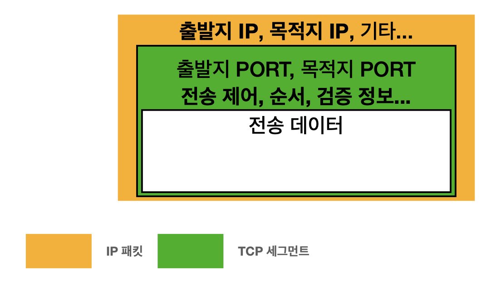
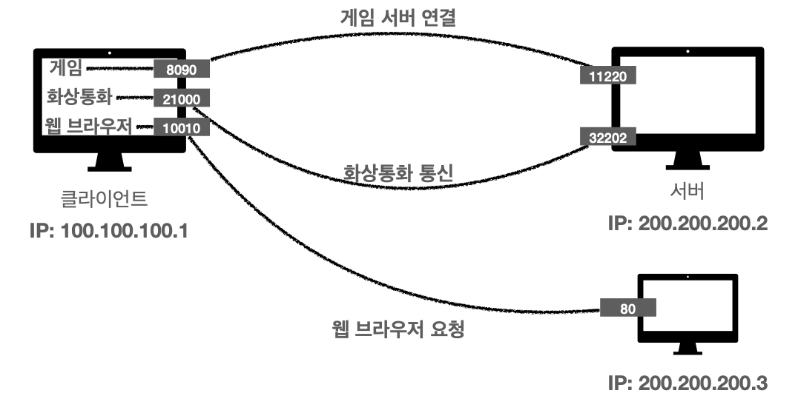

# 인터넷 네트워크
##목차
1. [IP](#1.-IP-(Internet-Protocol))
2. [TCP, UDP](#2.-TCP,-UDP)
3. [PORT](#3.-PORT)
4. [DNS](#4.-DNS(Domain-Name-System))
---

##1. IP (Internet Protocol) 

- ### 인터넷 프로토콜 역할
  - 지정한 IP 주소에 데이터 전달
  - 패킷(Packet)이라는 통신 단위로 데이터 전달

  
- IP 패킷 정보
  - 출발지 IP, 목적지 IP, 전송데이터, ....

  
  

- ###IP 프로토콜의 한계
  - 비연결성
  
  - 비신뢰성
  
  
  - 프로그램 구분
    - 같은 IP를 사용하는 서버에서 통신하는 애플리케이션이 둘 이상(ex 노래를 들으면서 게임을 하는 상황)
---
    
## 2. TCP, UDP

###1. TCP(Transmission Control Protocol)

- 프로토콜 계층
  

  
- TCP/IP 패킷 정보
  

- TCP 특징
  - **연결지향 - TCP 3 way handshake**
  
  
  - **데이터 전달 보증**

  - **순서보장**
  
  
    ->  이로인해 위의 [IP의 한계 2가지 해결](#IP-프로토콜의-한계) **신뢰성** 있는 프로토콜

### 2. UDP(User Datagram Protocol)
- 기능이 거의 없음
- 연결지향 X
- 데이터 전달 보증 X
- 순서 보장 X
- IP와 거의 비슷 + **PORT** + 체크섬
- 애플리케이션에서 추가 작업 필요

---
## 3. PORT
- 위의 [IP에서의 한계점](#IP-프로토콜의-한계) 3가지중 2가지는 TCP로 해결
- 나머지 한가지 문제점 **한번에 둘 이상 연결해야 한다면?** -> 패킷들이 어떤 서버에서 오는 패킷인지 인지를 못하는 문제점 발생

####PORT - 같은 IP 내에서 프로세스 구분

- PORT 번호
  - 0 ~ 65535 : 할당 가능
  - 0 ~ 1023 : 잘 알려진 포트(되도록 사용X)
    - FTP - 20, 21
    - TELNET - 23
    - HTTP - 80
    - HTTPS - 443

---
## 4. DNS(Domain Name System)
- IP는 기억하기 어렵다
- IP는 변경될 수 있다

### DNS 사용
