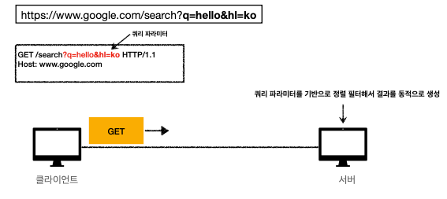
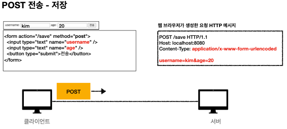
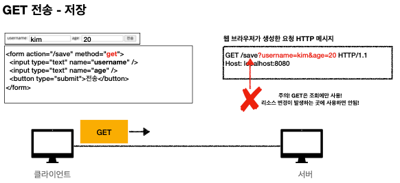
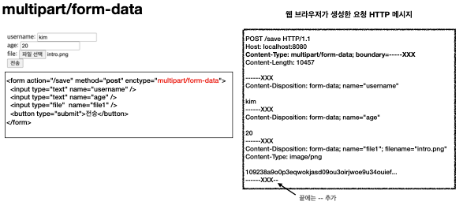
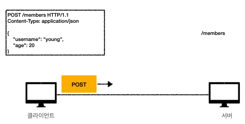

# 5. HTTP Method Utilize

## 목차

- ### 1. 클라이언트에서 서버로 데이터 전송

- ### 2. HTTP API 설계 예시

---

# 1. 클라이언트에서 서버로 데이터 전송

- ## 데이터 전달 방식
  - 쿼리 파라미터를 통한 데이터 전송
    - GET
    - 주로 정렬 필터(검색어)
  - 메시지 바디를 통한 데이터 전송
    - POST, PUT, PATCH
    - 회원 가입, 상품 주문, 리소스 등록, 리소스 변경

- ## 4가지 상황 예시
  - ### 정적 데이터 조회 -> 이미지, 정적 텍스트 문서
    - 이미지, 정적 텍스트 문서
    - 조회는 GET 사용
    - 정적 데이터는 일반적으로 쿼리 파라미터 없이 리소스 경로로 단순하게 조회 가능
    
  - ### 동적 데이터 조회  
  
  - 주로 검색, 게시판 목록에서 정렬 필터(검색어)
  - 조회 조건을 줄여주는 필터, 조회 결과를 정렬하는 정렬 조건에 주로 사용
  - 조회는 GET 사용
  - GET은 쿼리 파라미터 사용해서 데이터를 전달

- ## HTML Form 데이터 전송
  - POST  
  
    - Content-Type : application/x-www-form-urlencoded 사용
    - form 내용을 메시지 바디를 통해서 전송 (key=value, 쿼리 파라미터형식)
    - 전송데이터를 url encoding 처리 -> abc김 : abc%EA%B9%80
  
  - GET  
  
    - GET은 리소스 변경이 발생하는 곳에 사용 X -> 조회에서만 사용!!
  - multipart/form-data  
  
    - 파일 업로드 같은 바이너리 데이터 전송시 사용
    - 다른 종류의 여러 파일과 폼의 내용 함계 전송 가능

- ## HTTP API 데이터 전송  
    
  - 서버 to 서버 -> html과같은 리소스가 없음
  - 앱클라이언트 (아이폰, 안드로이드)
  - 웹 클라이언
    - HTML에서 Form 대신 JS를 통한 통신에 사용 (AJAX)
  - POST, PUT, PATCH : 메시지 바디를 통해 전송
  - GET : 조회, 쿼리 파라미터로 전달
  - Context-Type : application/json을 주로 사용
  
---

# 2. HTTP API 설계 예시