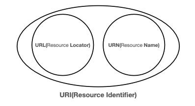
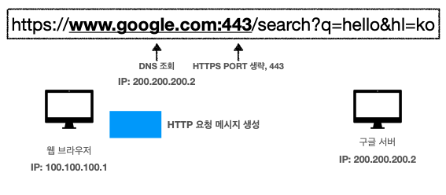
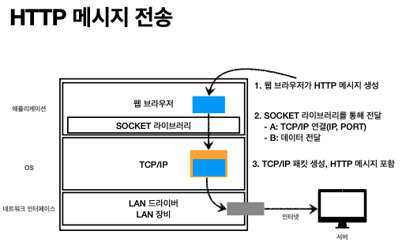
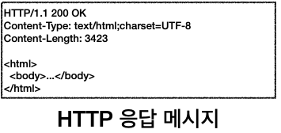
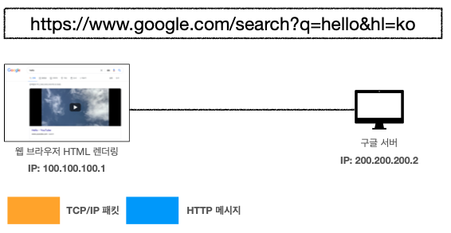

# URI와 웹 브라우저 요청 흐름

## 목차
### [1. URI](#1.-URI)

### [2. 웹 브라우저 요청 흐름](#2.-웹-브라우저-요청-흐름)

---

## 1. URI

- ### URI(Uniform Resource Identifier)
  - `URI`는 로케이터(locator), 이름(name) 또는 둘 다 추가로 분류 가능
    
  - **U**niform : 리소스 식별하는 통일된 방식
  - **R**esource : 자원, URI로 식별할 수 있는 모든 것(제한 없음)
  - **I**dentifier : 다른 항목과 구분하는데 필요한 정보

- ### URL, URN
  - `URL` - Locator : 리소스가 있는 위치를 지정
  - `URN` - Name : 리소스에 이름을 부여
  - 위치는 변할 수 있지만, 이름은 변하지 않음
  - `URN` 이름만으로 실제 리소스를 찾을 수 있는 방법이 보편화 되지 않음
  - 주로 `URI`와 `URL`을 같은 의미로 이야기함
  
- ### URL 분석
  - 분석 URL : `https://www.google.com/search?q=hello&hl=ko`
    - `https` : 프로토콜
    - `www.google.com` : 호스트명
    - `443` : 포트번호
    - `/search` : 패스
    - `q=hello&hi=ko` : 쿼리 파라미터
- ### URL 구조 
  `scheme://[userinfo@]host[:port][/path][?query][#fragment]`
  - `scheme`
    - 주로 프로토콜(http, https, ftp, ...) 사용
    - http는 80포트, https는 443 포트를 주로 사용, 포트는 생략 가능
  - `userinfo`
    - URL에 사용자정보를 포함해서 인증
    - 거의 사용하지 않음
  - `host`
    - 호스트명
    - 도메인명 또는 IP 주소를 직접 사용
  - `port`
    - 접속포트
    - 일반적으로 생략, 생략시 http는 80 https는 443
  - `path`
    - 리소스 경로, 계층적 구조
    - ex) /members/100, items/iphone12
  - `query`
    - key=value 형태
    - ?로 시작, &로 추가 가능 ?keyA=valueA&keyB=valueB
    - query parameter, query string 등으로 불림, 웹서버에 제공하는 파라미터, 문자 형태
  - `fragment`
    - html 내부 북마크 등에 사용
    - 서버에 전송하는 정보 아님
---

## 2. 웹 브라우저 요청 흐름
- `https://www.google.com/search?q=hello&hl=ko` 검색
- `DNS`을 조회해서 `IP`주소를 조회하여 HTTP 요청 메시지 생성
    
  - http 요청 메시지 -> `GET /search?q=hello&hl=ko HTTP/1.1 Host: www.google.com`
- http 메시지 전송
  
- 구글 서버에서 메시지 확인후 http 응답 메시지 생성

- 구글 서버에서 브라우저로 전송후 브라우저는 html 렌더링

