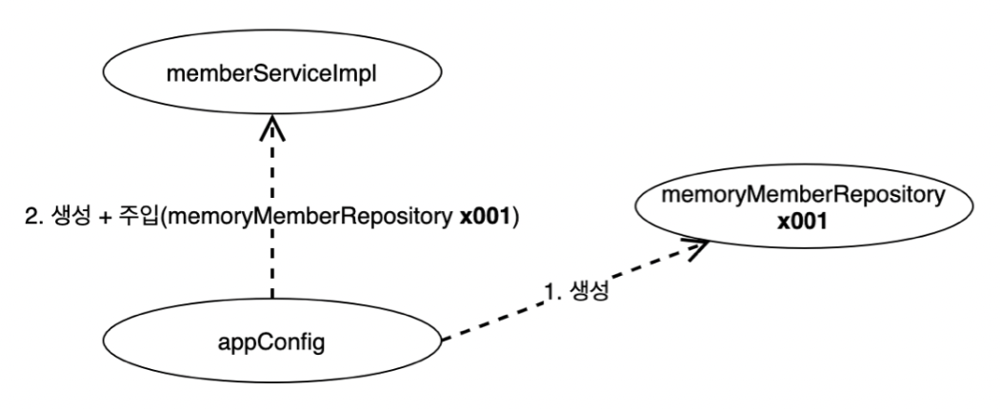
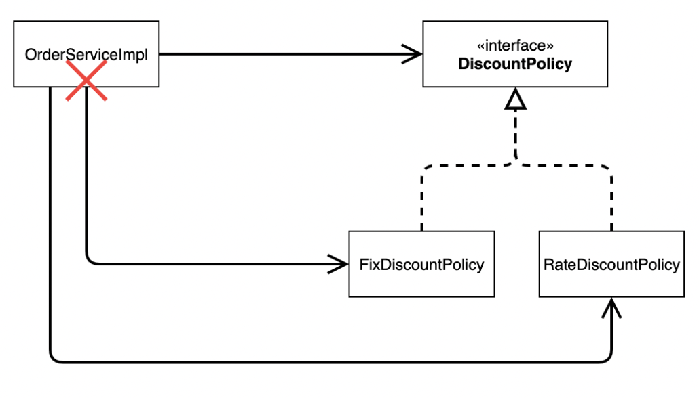
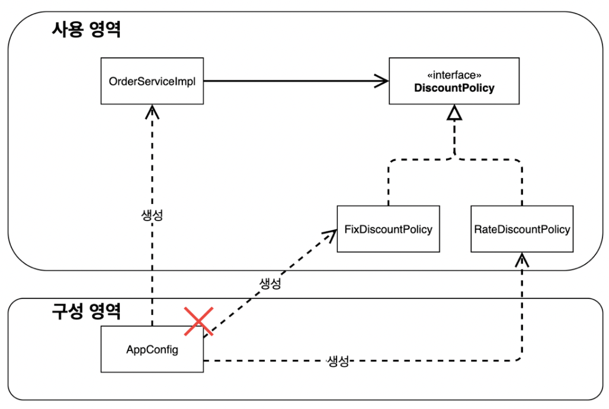

# AppConfig

- [애플리케이션의 클라이언트 부분](./../Doc_OOP/README.md)인 `MemberServiceImpl`, `OrderServiceImpl`은 기능이 변경되어도 수정이 필요없도록 한다
- 의존관계에 상관없이 실행부분만 신경 쓰도록 `AppConfig`에서 구현객체를 생성하고 생성자를 통해 **주입**해준다
- 애플리케이션 전체 동작 방식을 설정(ex - 회원저장소 종류, 할인정책 방식)


- ### AppConfig.java
    ```java
            package spring.core;
    
    import spring.core.discount.DiscountPolicy;
    import spring.core.discount.FixDiscountPolicy;
    import spring.core.discount.RateDiscountPolicy;
    import spring.core.member.MemberRepository;
    import spring.core.member.MemberService;
    import spring.core.member.MemberServiceImpl;
    import spring.core.member.MemoryMemberRepository;
    import spring.core.order.OrderService;
    import spring.core.order.OrderServiceImpl;
    
    public class AppConfig {
        
        public MemberService memberService(){
            return new MemberServiceImpl(memberRepository());
        }
        
        public OrderService orderService(){
            return new OrderServiceImpl(memberRepository(),
                    discountPolicy());
        }
        
        public MemberRepository memberRepository() {
            return new MemoryMemberRepository();
        }
        
        public DiscountPolicy discountPolicy(){
            return new RateDiscountPolicy();
        }
    }
    
    ```
  
    - AppConfig에서 구현 클라이언트 클래스인 `MemberServiceImpl`, `OrderServiceImpl`를 생성해서 반환해준다
    - 기존 클라이언트는 스스로 구현 객체를 생성하고 연결하여 스스로 제어, 하지만 AppConfig에 의해 제어 당하게 된다 -> **제어의 역전** `IoC(Inversion of Control)` 
    - 이때 생성자를 통해서 `memberRepository`, `DiscountPolicy`의 구현 클래스를 만들어서 주입해준다 -> 이를 **생성자 주입**, `DI(Dependency Injection)` 이라고한다
        
  
  
- ### MemberServiceImpl.java
    ```java 
      public class MemberServiceImpl implements MemberService{
            
           private final MemberRepository memberRepository;
            
           public MemberServiceImpl(MemberRepository memberRepository) {
               this.memberRepository = memberRepository;
           }
            
          ...
      }
    ```

- ### OrderServiceImpl.java
    ```java
    public class OrderServiceImpl implements OrderService{

        private final MemberRepository memberRepository;
        private final DiscountPolicy discountPolicy;

        public OrderServiceImpl(MemberRepository memberRepository, DiscountPolicy discountPolicy) {
            this.memberRepository = memberRepository;
            this.discountPolicy = discountPolicy;
        }  
    }
    ```
  - `MemberServiceImpl`, `OrderServiceImpl` 모두 내부 코드에서는 인터페이스만 선언하고 구현 객체는 `AppConfig`를 통해 생성자로 주입 받는다


- ### 기능 변경
  - `AppConfig`을 이용하여 생성자 주입을 하기전에는 기능을 변경할시 [여러 문제점](./../Doc_OOP/README.md "5. 할인 정책 변경시 문제점 참고")(5.할인 정책 변경시 문제점 참고)이 발생하였다.
    
  
  - `AppConfig` 적용 후
  
  ```java
    public class AppConfig {
  
        ...
        
        public DiscountPolicy discountPolicy(){
            //return new RateDiscountPolicy();
            return new FixDiscountPolicy();
        }
    }
    ```
    
    - `MemberServiceImpl`, `OrderServiceImpl`수정 필요없이 `AppConfig`만 수정하면 완료
    
  