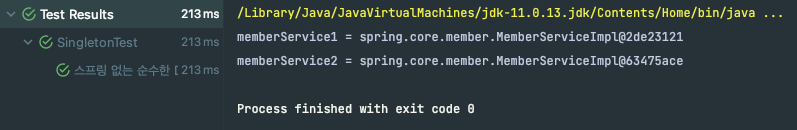

# Singleton

- ### Singleton 테스트
  - 클라이언트에서 요청이 들어올 때 계속해서 개체가 생성되는 문제가 발생 -> 메모리 낭비가 심함
    ```java
    public class SingletonTest {
    
        @Test
        @DisplayName("스프링 없는 순수한 DI 컨테이너")
        void pureContainer() {
            AppConfig appConfig = new AppConfig();
    
            //1. 조회: 호출할 때 마다 객체를 생성
            MemberService memberService1 = appConfig.memberService();
    
            //2. 조회: 호출할 때 마다 객체를 생성
            MemberService memberService2 = appConfig.memberService();
    
            //참조값이 다른 것을 확인
            System.out.println("memberService1 = " + memberService1);
            System.out.println("memberService2 = " + memberService2);
    
            //memberService != memberService2
            Assertions.assertThat(memberService1).isNotSameAs(memberService2);
    
        }
    }
    ```
  - 결과
  
