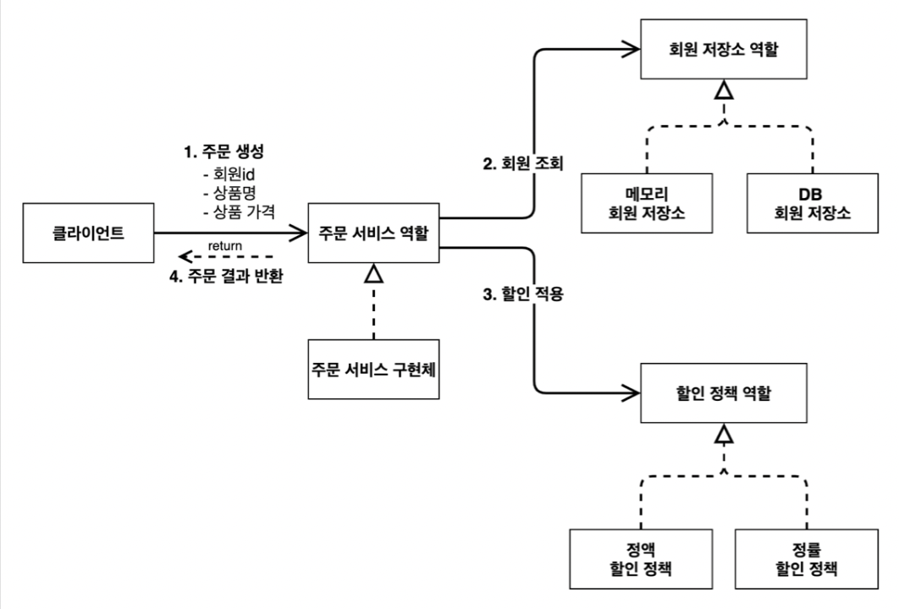

# 순수 자바를 이용한 객체지향 설계

- ### 현재 프로젝트 상황
    
  - 회원 저장소로 메모리를 사용할지, DB를 사용할지 정해지지 않은 상태
  - 할인 정책이 정액할인, 정률할인이 정해지지 않은 상태
  - 일단 회원은 메모리를 사용하고 할인은 정액 할인으로 개발함
  
  - **나중에 할인 정책을 변경하면서 객체지 설계 원칙 (DIP, OCP)가 지켜지는 확인!!**

- ### 회원 저장
  - 회원 저장소 인터페이스 -> 역할
    ```java
      package spring.core.member;

      public interface MemberRepository {
          // 회원 저장 
          void save(Member member);
          // 회원 조회
          Member findById(Long memberId);
      }

      ```
  - 회원 메모리 저장소 -> 구현
    ```java
      package spring.core.member;

      import java.util.HashMap;
      import java.util.Map;

      public class MemoryMemberRepository implements MemberRepository{
          // HashMap에 회원의 id와 이름 저장
          private static Map<Long, Member> store = new HashMap<>();

          @Override
          public void save(Member member) {
              store.put(member.getId(), member);
          }

          @Override
          public Member findById(Long memberId) {
              return store.get(memberId);
          }
      }
      ```
      - 간단하게 회원 아이디와 이름을 `HashMap` 저장 -> 실제는 동시성 이슈가 발생 할 수 있으므로 `ConcurrentHashMap`을 추천 


- ### 할인 정책
  
  - 할인 정책 인터페이스 -> 역할 
    ```java
    package spring.core.discount;

    import spring.core.member.Member;

    public interface DiscountPolicy {
        /** 
        * @return 할인 대상 금액액
        * */
        int discount(Member member, int price);
    }
    ```
    
  - 정액 할인 및 정률 할인 정책 -> 구현
  
    ```java
      // 정액 할인 정책
      public class FixDiscountPolicy implements DiscountPolicy{

          private int discountFixAmount = 1000; // 1000원 할인

          @Override
          public int discount(Member member, int price) {
              if (member.getGrade() == Grade.VIP){
                  return discountFixAmount;
              } else {
                  return 0;
              }
          }
      }
    
      // 정률 할인 정책
      public class RateDiscountPolicy implements DiscountPolicy {

          private int discountPercent = 10;

          @Override
          public int discount(Member member, int price) {
              if(member.getGrade() == Grade.VIP){
                  return price * discountPercent / 100;
              }else {
                  return 0;
              }
          }
      }
      ```
    - 회원의 등급이 VIP일 때 할인 정책 적용
  
- ### 주문 서비스 구현체
  
    ```java
    public class OrderServiceImpl implements OrderService {
  
        private final MemberRepository memberRepository = new MemoryMemberRepository();
        private final DiscountPolicy discountPolicy = new FixDiscountPolicy();
        
        @Override
        public Order createOrder(Long memberId, String itemName, int itemPrice) {
            Member member = memberRepository.findById(memberId);
            int discountPrice = discountPolicy.discount(member, itemPrice);

            return new Order(memberId, itemName, itemPrice, discountPrice);
        }
    }
    ```