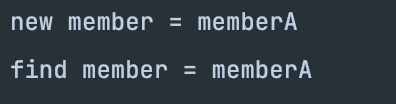
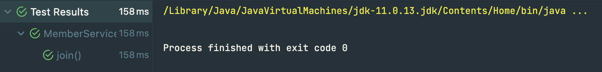
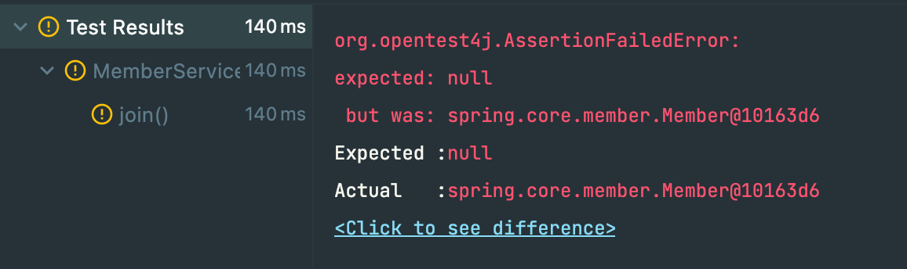

# Test 작성

- ### Test 환경 
  - Intellij
  - Spring boot
  - JUnit


- ### 순수 Java Test
  - 회원가입을 하고 회원 아이디를 이용하여 조회하는 기능
  
  
  - MemberApp.java
      ```java
      public class MemberApp {

          public static void main(String[] args) {
              Member member = new Member(1L, "memberA", Grade.VIP);
              memberService.join(member);

              Member findMember = memberService.findMember(1L);
              System.out.println("new member = " + member.getName());
              System.out.println("find member = " + findMember.getName());
          }
      }
    ```
    - Test 결과
      
  

- ### JUnit을 이용한 Test
  - MemberServiceTest.java
  ```java
    public class MemberServiceTest { 
  
        MemberService memberService;
  
        // test 실행전 실행되는 로직직
        @BeforeEach
        public void beforeEach(){
            AppConfig appConfig = new AppConfig();
            memberService = appConfig.memberService();
        }
  
        @Test
        void join(){
            // given
            Member member = new Member(1L, "memberA", Grade.VIP);

            // when
            memberService.join(member);
            Member findMember = memberService.findMember(1L);

            // then
            Assertions.assertThat(member).isEqualTo(findMember);
        }
    }
  ```
  - Test 결과
    - Test 성공
    
    
    - Test 실패
    
  - 순수 자바 코드로 테스트하게 되면 내가 원하는 값이 나왔는지 직접 확인을 해야됨
  - JUnit을 이용하면 통과되면 초록색으로 오류가 생기면 빨간색으로 체크되면서 차이를 확인까지 가능

- ### Test 작성 Tips
  - `@Test` -> `import org.junit.jupiter.api.Test`
  - `DisplayName()` -> 어떠한 테스트인지 보기편하게 한글로 명시할수있다.
  - Test 작성 순서
    - // givne : 어떠한 환경일 때
    - // when : 어떠한 Test를 했을 때
    - // then : 어떠한 결과가 나와야한다
  - Test 검증 방법
    - `Assertions` -> `org.assertj.core.api`
    - `Assertions.assertThat(member).isEqualTo(findMember)` -> `member`와 `findMember`가 같은지 확인